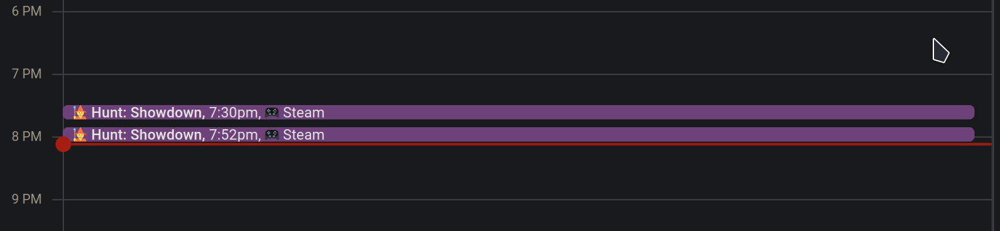

# SteamDiary

SteamDiary integrate with Google Calendar adding time played and achievements
A simple application that can be used to add google calendar events for game time played for all steam games.

# @T&Ts:

- This will only log time played while the user is online

# Prerequisites:

- Steam API key
- Google Calendar API key
- Google Calendar ID
- docker-compose & docker
- Google Cloud Project

# How to use:

- Clone the repo
- Install docker and docker-compose
- Create a `.env` file in the root of the project
- Add the following environment variables to the `.env` file
  - STEAM_API_KEY=your_steam_api_key
  - GOOGLE_CALENDAR_ID=your_google_calendar_id
  - GOOGLE_APPLICATION_CREDENTIALS=your_google_application_credentials
  - GOOGLE_CALENDAR_ID=your_google_calendar_id
  - GOOGLE_CALENDAR_SUMMARY=your_google_calendar_summary
  - GOOGLE_CALENDAR_DESCRIPTION=your_google_calendar_description
- Setup a google cloud project and enable the google calendar API
- Create a service account and download the json file
- Create a new calendar
  - go to calendar settings and share the calendar with the service account email
  - note down the calendar id
- Add the json file to the root of the project
- export your environment variables set in docker-compose file
- Run the program and `docker-compose up`
- benefit...
